<p align="center">
  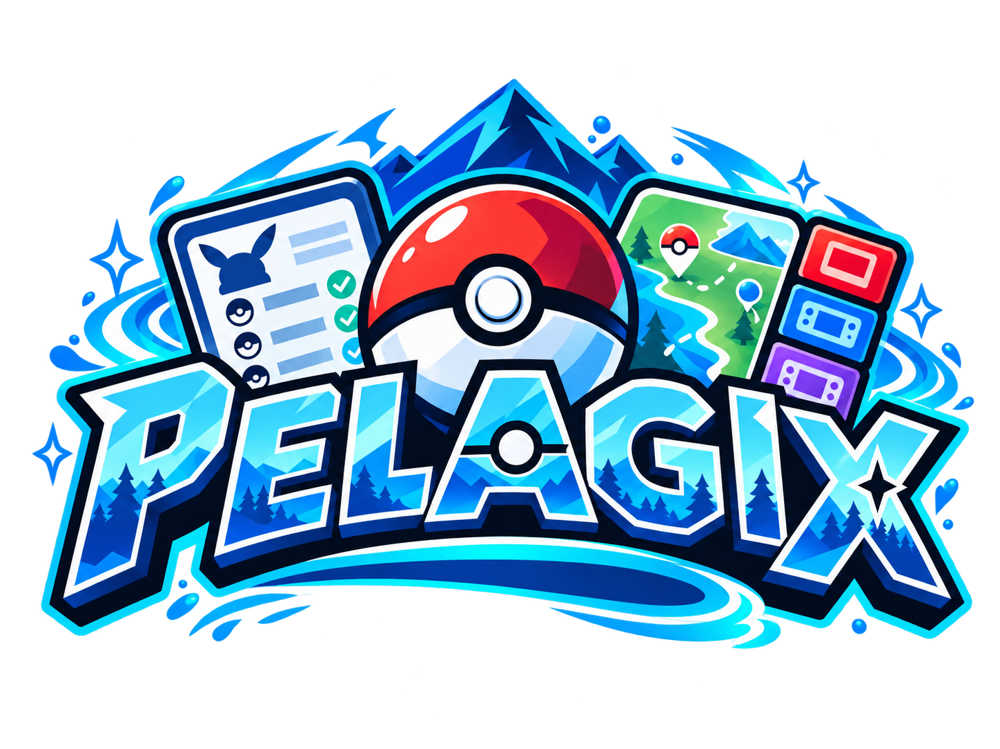
</p>

<p align="center">
  <b>Pelagix is a desktop Living Dex tracker for the Pokémon games.</b><br>
  Find a Pokémon, see every game and place it can be obtained, and log each one you catch.
</p>

<p align="center">
  
  
  
  
  <a href="https://github.com/HydrosPlays/Pelagix/releases"></a>
</p>

<p align="center">
  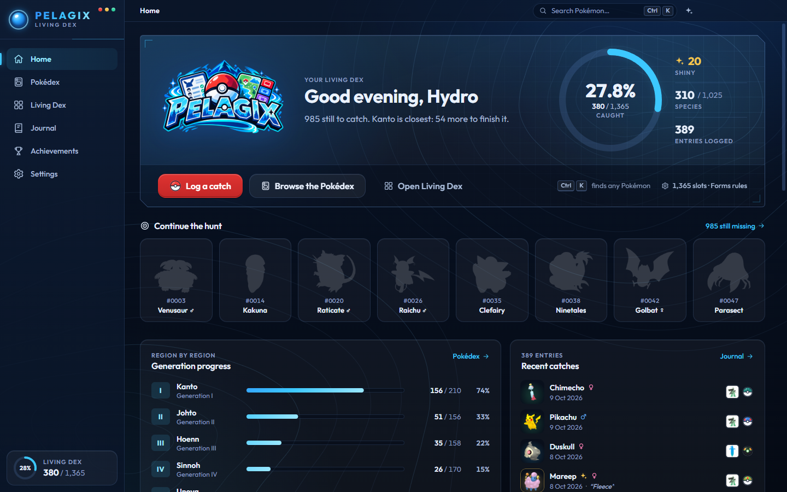
</p>

<p align="center">
  <sub>Windows 10 and 11 · version 0.7.0 · GPL-3.0 · an unofficial fan project</sub>
</p>

> The screenshots on this page come from version 0.1.0 running a generated demo collection
> (389 entries, trainer "Hydro"), so the numbers in them are that collection's. They can be
> re-created with `npm run screenshots`.

## Contents

- [What it is](#what-it-is)
- [How it works](#how-it-works)
- [Features](#features)
  - [Pokédex browser](#pokédex-browser)
  - [Species page and where to find it](#species-page-and-where-to-find-it)
  - [Logging a catch](#logging-a-catch)
  - [Living Dex and Shiny Living Dex](#living-dex-and-shiny-living-dex)
  - [HOME Dex](#home-dex)
  - [Viewing one game](#viewing-one-game)
  - [Forms and the Living Dex rules](#forms-and-the-living-dex-rules)
  - [Journal](#journal)
  - [Achievements](#achievements)
  - [Home dashboard](#home-dashboard)
  - [Settings](#settings)
  - [Languages](#languages)
  - [Search and keyboard shortcuts](#search-and-keyboard-shortcuts)
  - [Updates](#updates)
- [Supported games](#supported-games)
- [The data](#the-data)
- [Getting Pelagix](#getting-pelagix)
- [Where your data lives](#where-your-data-lives)
- [Building from source](#building-from-source)
- [Project structure](#project-structure)
- [Tech stack](#tech-stack)
- [Credits and licence](#credits-and-licence)

## What it is

A Living Dex is a collection that holds one of every Pokémon at the same time. Pelagix is where
you keep track of yours, across every game you play. You look a Pokémon up, Pelagix shows every
game it can be obtained in and exactly how and where, and you log the catch: the game, the
location, the ball, the form, the gender, whether it is shiny. Each catch ticks off its slot in
your Living Dex, including alternate forms and shinies. The same Pokémon can be logged again from
as many other games as you like, and achievements unlock as the collection grows.

Pelagix is a record you keep by hand. It does not read save files and it does not connect to
Pokémon HOME or to any game. What it brings is the reference data, already filled in: where each
of the 1,025 Pokémon is found in 46 games and services, which forms exist, and which balls each
game has.

## How it works

### 1. Find a Pokémon in the Pokédex

The Pokédex lists every species. Search by name or number, or narrow the list by generation,
type, caught status, category, or the game you are playing. Pokémon you have already logged carry
a Poké Ball mark with the number of entries; a gold sparkle means one of them is shiny.

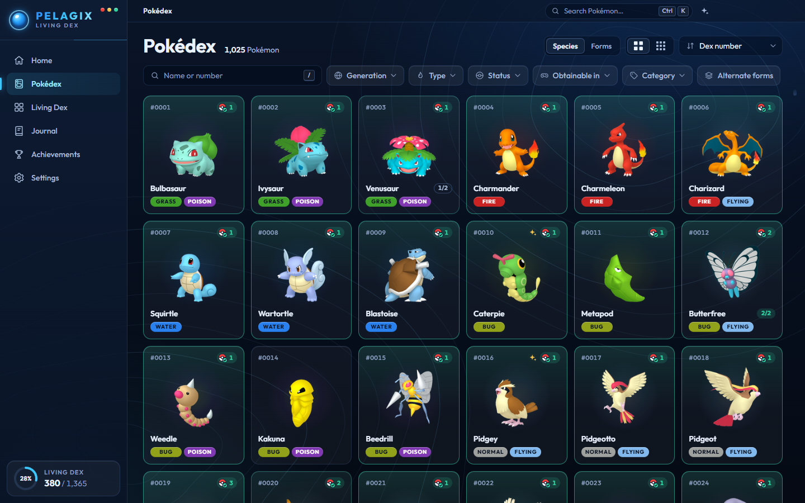

### 2. See every game and place it can be obtained

Open a Pokémon and scroll to **Where to find it**. The list on the left holds every game the
Pokémon is in, marked where it is event only or transfer only. Pick one, and the pane on the
right lists every way that game offers the Pokémon, grouped by kind, with the place, the method,
the level range and any conditions such as weather or time of day.

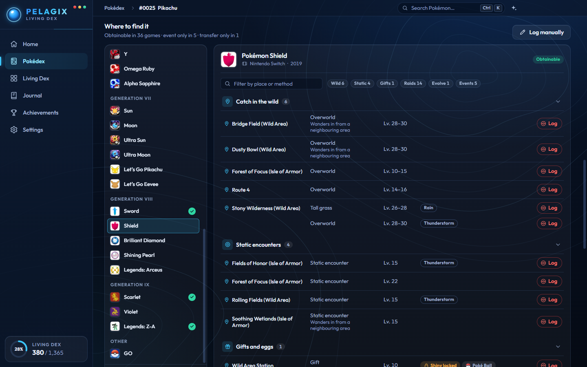

Here Pikachu is obtainable in 36 games, event only in 5 and transfer only in 1. The ticks beside
Sword, Scarlet and Legends: Z-A mean a Pikachu from those games is already logged.

### 3. Log the catch

Press **Log** on the row you actually used. The entry editor opens with the game, the method and
the location filled in, and with the ball, gender or level preset when the source fixes them. Add
the rest: ball, gender, level, date, shiny, nickname, Original Trainer and notes, and, if you
want them, the ability, PID, IVs and EVs. A preview of the
finished entry card is shown beside the form.

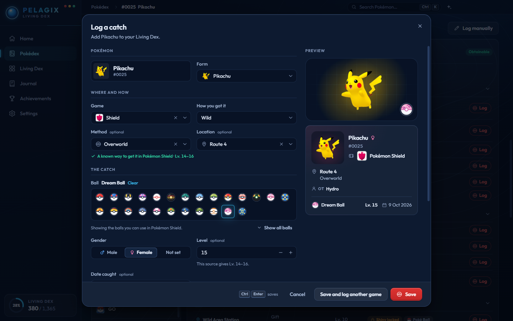

### 4. Watch it land in the Living Dex

Saving plays a short capture animation and the Pokémon's slot is filled. The Living Dex lays the
collection out in boxes of 30, six columns by five rows, in National Pokédex order. Caught
Pokémon are in colour with a ball icon; everything still missing is a silhouette.

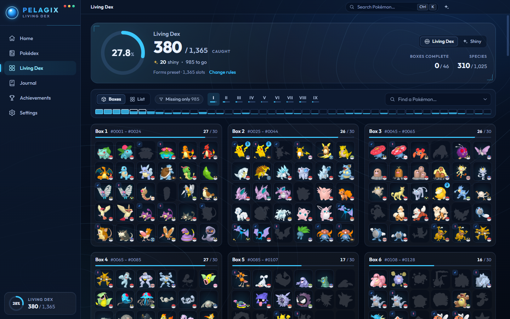

### 5. Log the same Pokémon again from another game

One slot can hold any number of entries. Use **Save and log another game** in the editor, or
**Log another** on the Pokémon's page, to record the same Pokémon from a different game. Each
entry keeps its own card with the system icon and game icon it came from, its location, ball,
level and date.

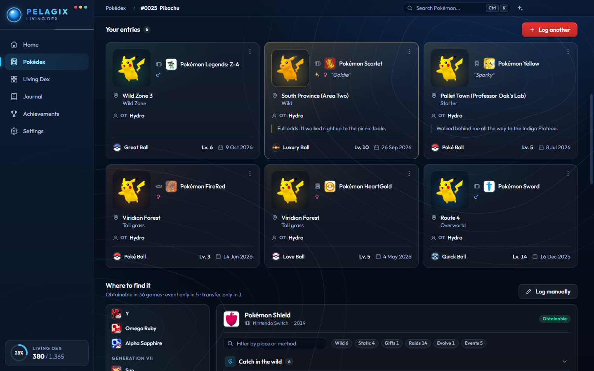

## Features

### Pokédex browser

- **Two displays.** *Species* shows one tile per species (1,025). *Forms* shows one tile per
  Living Dex slot under your rules (1,365 with the default rules), each with its own render.
- **Search** by name or National Pokédex number. Press `/` to jump to the search box.
- **Filters**, which combine and appear as removable chips:
  - *Generation* I to IX.
  - *Type*, one or several, matching any of them or all of them.
  - *Status*: caught, missing, shiny caught, shiny missing, or logged from two or more games.
  - *Obtainable in* a game of your choice, optionally only what you still need, and optionally
    including Pokémon that are event-only there.
  - *Category*: Legendary, Mythical, Baby, Starter, Fossil, Pseudo-legendary, Ultra Beast, Paradox.
  - *Alternate forms*: only Pokémon with more than one form to collect.
- **Sort** by Dex number, name, most recently logged or most entries.
- **Tile size**: large or small.
- **Shiny view.** The sparkle button in the title bar shows shiny renders in place of the regular
  ones.
- Coming back from a Pokémon's page restores the scroll position, the search and the filters.

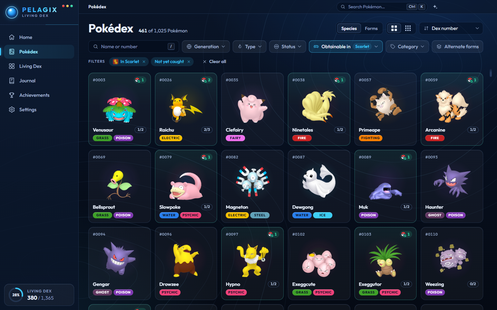

"What can I still get in Scarlet?" is one filter: *Obtainable in* Scarlet, with *Only what I
still need* switched on.

### Species page and where to find it

Every Pokémon has a page with:

- its Pokémon HOME render, with **Shiny**, **Female** and **Gigantamax** toggles where those
  renders exist, and a sweet picker for Alcremie;
- its number, generation, category, types, Pokédex text, height, weight, gender ratio and
  regional Pokédex numbers;
- its **evolution family**, with how each member evolves;
- its **forms**, grouped by kind, with a tick and a count on the ones you have logged;
- **your entries** of it;
- **where to find it**, game by game.

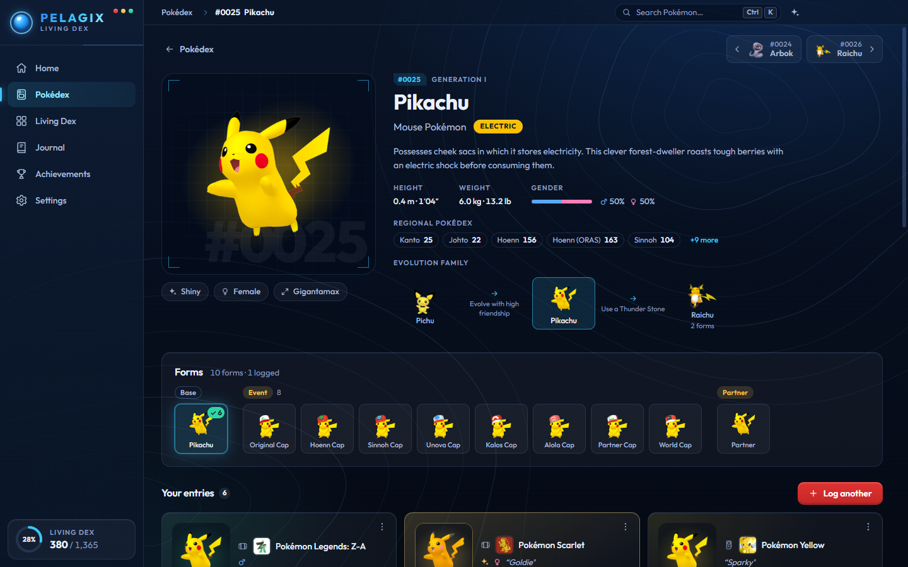

For each game a Pokémon is **Obtainable**, **Event only** (every source there is time-limited),
**Transfer only** (it exists in the game but has to be brought in) or not in the game at all.
The sources of the selected game are grouped into these sections:

| Section | What it covers |
| --- | --- |
| Catch in the wild | Tall grass, caves, surfing, fishing, Headbutt, hordes, SOS calls, Friend Safari, Hidden Grottoes, Safari Zones, mass outbreaks, Wild Zones and other ordinary wild encounters |
| Static encounters | Fixed overworld and scripted battles, roaming Pokémon, Island Scan |
| Gifts and eggs | Starters, fossils, prizes, gifts from characters, gift eggs |
| In-game trades | Trades with characters in the game |
| Raids and outbreaks | Max Raid dens, Dynamax Adventures, Tera Raid Battles by star rating, event mass outbreaks |
| Shadow Pokémon | Pokémon Colosseum and Pokémon XD |
| Pokéwalker | Pokéwalker courses in HeartGold and SoulSilver |
| Dream World | Dream World, Dream Radar and Global Link promotions |
| Evolve | The Pokémon it evolves from and the method in that game |
| Change form | In-game form changes and fusions |
| Breed | Hatching it from an egg |
| Events | Mystery Gift and other real-world distributions, with the Original Trainer where known |

Rows carry tags for what the game fixes: shiny locked or always shiny, a fixed ball, a fixed
gender, Alpha, and gifts that arrive through another product ("via Pokémon Ranger"). When a game
has eight or more sources, a filter box and section chips appear. Every row has a **Log** button,
and **Log manually** covers anything the list does not have.

An evolution can be opened in place to show where its earlier stage is found in the same game,
and logged straight from there:

| Evolve-only source | Event-only Pokémon |
| --- | --- |
| 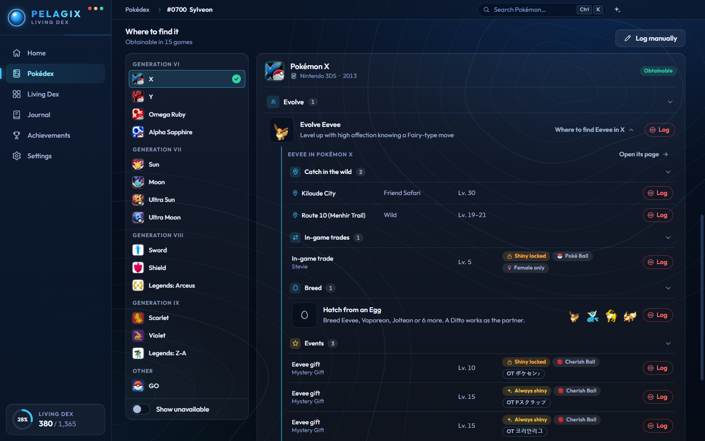 | 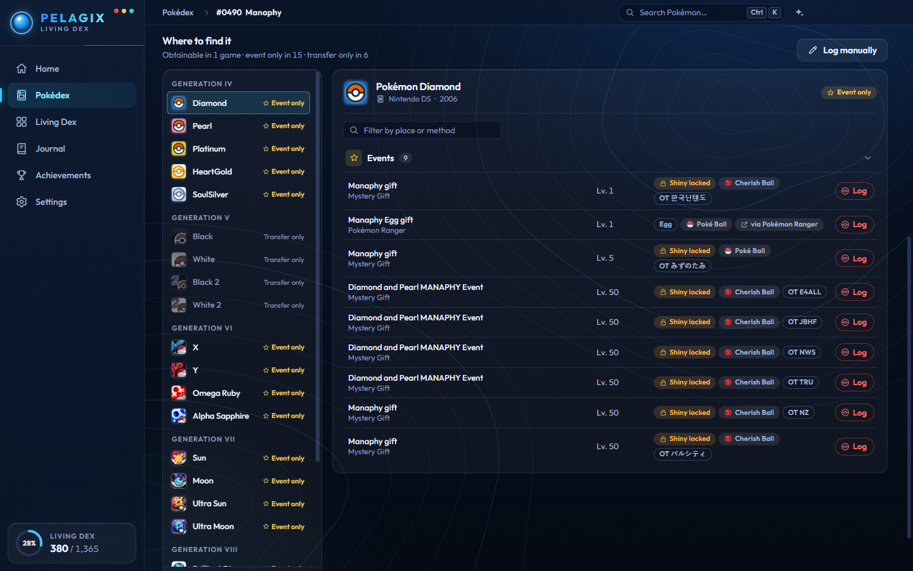 |
| Sylveon in Pokémon X: evolve Eevee, with Eevee's own sources in X listed underneath. | Manaphy: obtainable in 1 game, event only in 15, transfer only in 6. |

### Logging a catch

An entry records:

| Field | Notes |
| --- | --- |
| Pokémon, form, sweet | Any form except those that are never owned. The sweet applies to Alcremie. |
| Game | Any of the 46 games and services. Games where the Pokémon can be obtained are listed first. |
| How you got it | Wild, static encounter, gift, gift egg, in-game trade, Max Raid, Tera Raid, mass outbreak, Shadow Pokémon, Pokéwalker, Dream World, event, evolved, bred, transferred or other. |
| Method and location | Suggested from the game's known sources, or typed freely. |
| Caught as | For an evolved Pokémon: what it was when you got it. |
| Ball | The balls usable in the chosen game are shown first; **Show all balls** reveals all 37. |
| Gender, level, date | Gender choices follow the species. The date defaults to today. |
| Shiny, Gigantamax, Alpha | Gigantamax is offered in Sword and Shield for forms that have it; Alpha in Legends: Arceus and Legends: Z-A. |
| Nickname, Original Trainer, notes | The Original Trainer starts as your trainer name. |

- When what you entered matches a known source, the editor says so and shows that source's level
  range. A source with a fixed ball or gender sets it for you.
- Marking a shiny-locked source as shiny shows a warning but never blocks you. It is your record.
- **Save and log another game** keeps the dialog open for the same Pokémon. `Ctrl+Enter` saves.
- Existing entries can be edited, duplicated and deleted. Deleting offers **Undo**.

### Living Dex and Shiny Living Dex

- **Boxes** of 30, or one continuous **List** with a divider per generation.
- A header with your completion: percentage, caught and total slots, shinies, how many are still
  to go, completed boxes and species.
- **Missing only** narrows the view to what you still need.
- **Jump** to any generation, **find** a Pokémon by name, or click the box index strip, which
  shows how full each box is.
- Click a slot to open its drawer: every entry in that slot, a link to where to find the
  Pokémon, and **Log this Pokémon**, already set to the slot's form and gender.
- The whole grid is one keyboard stop: arrow keys move between slots, `Home` and `End` along a
  row, `Ctrl+Home` and `Ctrl+End` to the first and last slot.

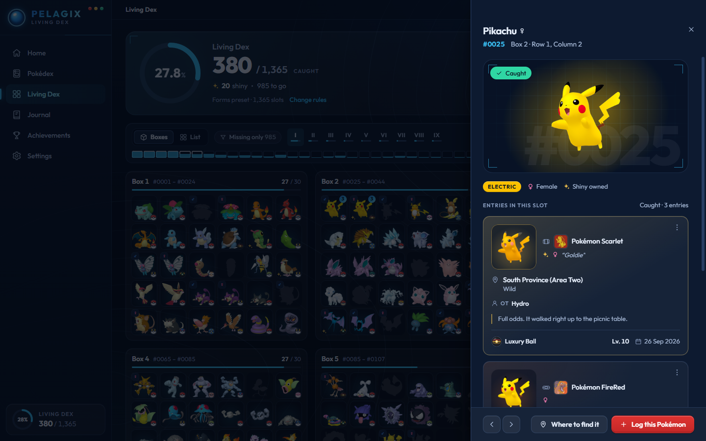

Switch the mode to **Shiny** and the same boxes become a Shiny Living Dex: only a shiny entry
fills a slot, and the renders are the shiny ones.

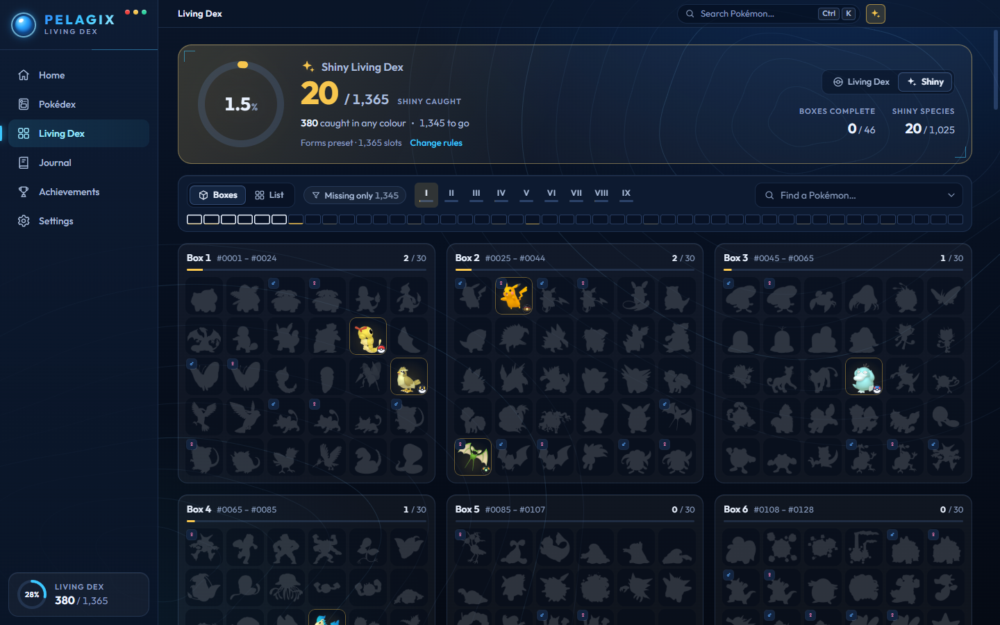

### HOME Dex

The HOME Dex shows which of your Pokémon you have sent to Pokémon HOME. It has the same slots
and boxes of 30 as the Living Dex, and follows the same rules and the same Shiny mode.

- Every slot is in one of three states: **in HOME**, **not sent yet** (caught, but not marked) or
  **not caught**. The chips above the boxes filter by state, so *Not sent yet* is your to-do list.
- Click a caught Pokémon to mark it as in HOME, and again to take the mark off. If several of
  your entries fill the slot, a list opens and you choose which one went to HOME.
- **Mark box** marks every caught Pokémon of a box at once, and can be undone straight afterwards.
- The mark belongs to the entry: the entry editor has an **In Pokémon HOME** switch, and marked
  entries carry a small HOME icon on their card and in the Journal.

Pelagix does not connect to Pokémon HOME. The marks are yours to set.

### Viewing one game

The Pokédex, the Living Dex and the HOME Dex each have an **Obtainable in** picker. Choose a game
and the page shows only the Pokémon you can obtain in it, in that game's own Pokédex order.

- A game with several Pokédexes is split into sections, each with its own count: Lumiose and
  Hyperspace for Legends: Z-A; Galar, Isle of Armor and Crown Tundra for Sword and Shield; Paldea,
  Kitakami and Blueberry for Scarlet and Violet; Central, Coastal and Mountain Kalos for X and Y.
  Pokémon obtainable in the game but in none of its Pokédexes come last.
- On the Living Dex and the HOME Dex, a slot then counts only if you caught it **in that game**,
  and the boxes are numbered within each section. The choice is shared by the two pages and
  remembered.
- On the Pokédex the sections appear while the list is sorted by number; the caught marks there
  keep meaning caught in any game.
- Games without a Pokédex of their own, such as Colosseum, XD and Pokémon GO, are filtered the
  same way and stay in National order.
- Event-only Pokémon are left out of a game's view.

### Forms and the Living Dex rules

Forms are first-class. A Pokémon's page lists each form with its own render, its own sources and
its own tick, and an entry is always logged as a specific form.

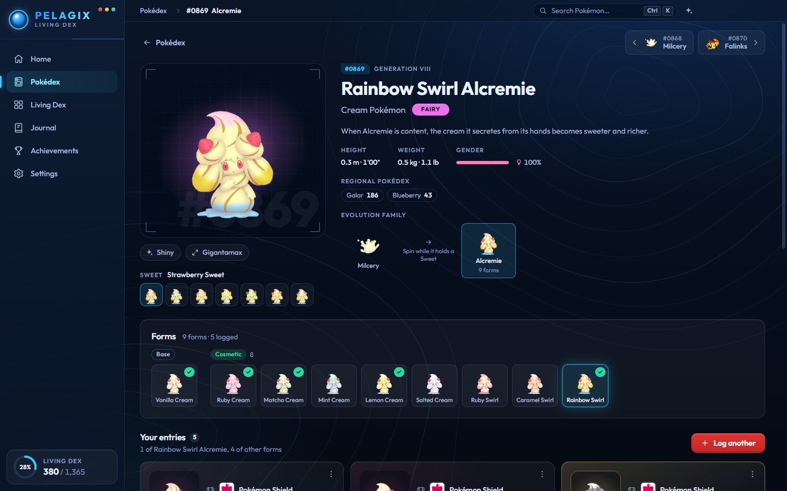

How many slots your Living Dex has is up to you. **Settings → Living Dex rules** decides which
kinds of form get a slot of their own. The base form of every species always has one. An entry of
a form whose own slot is switched off counts toward the species' base slot instead.

| Rule | Adds a slot for | Default |
| --- | --- | --- |
| Regional forms | Alolan, Galarian, Hisuian and Paldean forms | On |
| Gender forms | Meowstic, Indeedee, Basculegion and Oinkologne ♂ / ♀ | On |
| Gender differences | ♂ and ♀ of species whose genders look different | On |
| Cosmetic forms | Unown letters, Vivillon patterns, Alcremie creams and other permanent looks | On |
| Changeable forms | Rotom appliances, Deoxys, Shaymin, Oricorio and other forms you can switch freely | On |
| Held-item forms | Forms kept only while holding an item: Arceus plates, Silvally memories, Genesect drives, Ogerpon masks, and Origin Forme Dialga, Palkia and Giratina (44 slots) | On |
| Fusions | Kyurem, Necrozma and Calyrex fusions | Off |
| Event forms | Distribution-only forms such as cap Pikachu or Poké Ball Vivillon | Off |
| Partner forms | Let's Go partner Pikachu and Eevee | Off |
| Alcremie sweets | All 63 cream and sweet combinations instead of the 9 creams | Off |
| Mega Evolutions | Mega Evolutions and Primal Reversions | Off |
| Battle forms | Other battle-only states and totems | Off |
| Gigantamax | Every form that can Gigantamax | Off |

Three presets set them together. With the current data they give:

| Preset | Slots | What counts |
| --- | --- | --- |
| Species only | 1,025 | One slot per species. Any form fills it. |
| Forms (default) | 1,365 | Every form you can keep in a box: regional, gender, cosmetic, changeable and held-item. |
| Completionist | 1,627 | Everything, including Mega Evolutions, battle forms, Gigantamax and all 63 Alcremie. |

Any other mix is shown as *Custom*. Changing the rules never deletes an entry; it only changes
which slots exist and what your entries fill.

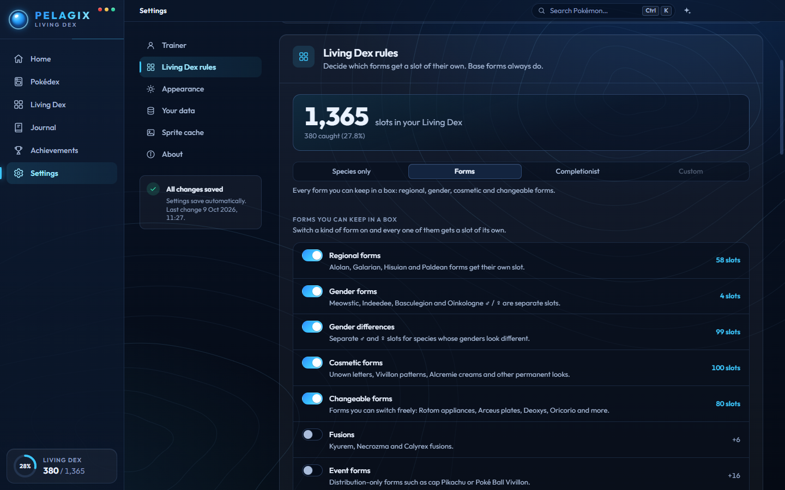

The figure beside each switch is what the rule is worth with the others left as they are: the
slots that depend on it while it is on, or the slots it would add while it is off. A slot that
needs two rules counts under both, so the figures can add up to slightly more than the total.
With the default rules that is one slot: the ♀ slot of Hisuian Sneasel needs both *Regional
forms* and *Gender differences*.

### Journal

Every entry from every game in one list.

- A summary of entries, Pokémon, shinies, games and systems. The game and system icons are
  shortcuts that filter the list.
- **Search** across names, nicknames, places, notes and Original Trainers.
- **Filter** by game, generation, system, ball, how it was obtained, a date range, or shiny only.
- **Sort** by date caught, date logged, Pokédex number or game, in either direction. Entries are
  grouped by month, generation or game to match.
- Each row opens the editor. Its menu has *Open Pokédex page*, *Edit*, *Duplicate* and *Delete*.
- **Select** switches to selection mode to delete several entries at once, with a single Undo.

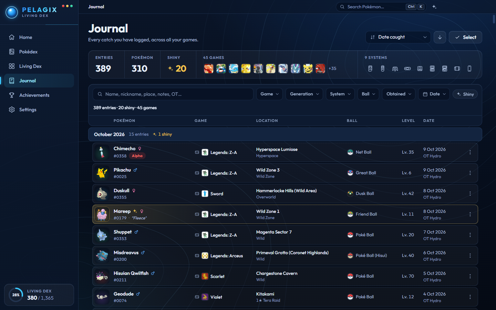

### Achievements

- **246 achievements** in eleven categories: Collector's Road, World Tour, Elemental Mastery,
  Starlight, Cartridge Shelf, Ball Capsule, Shapeshifters, Hall of Legends, Field Notes, Long Haul
  and Hidden Grotto, whose ten achievements stay secret until you unlock them.
- Four tiers, bronze, silver, gold and platinum, worth 10, 25, 50 and 100 points: 8,260 points in
  all.
- **Eight collector ranks**, from Novice Collector to Living Dex Master.
- A **Nearly there** strip with the achievements closest to done.
- Achievements about a set of Pokémon list which ones are still missing, with links to their pages.
- Unlocks are announced as they happen and are permanent: deleting an entry does not take one back.

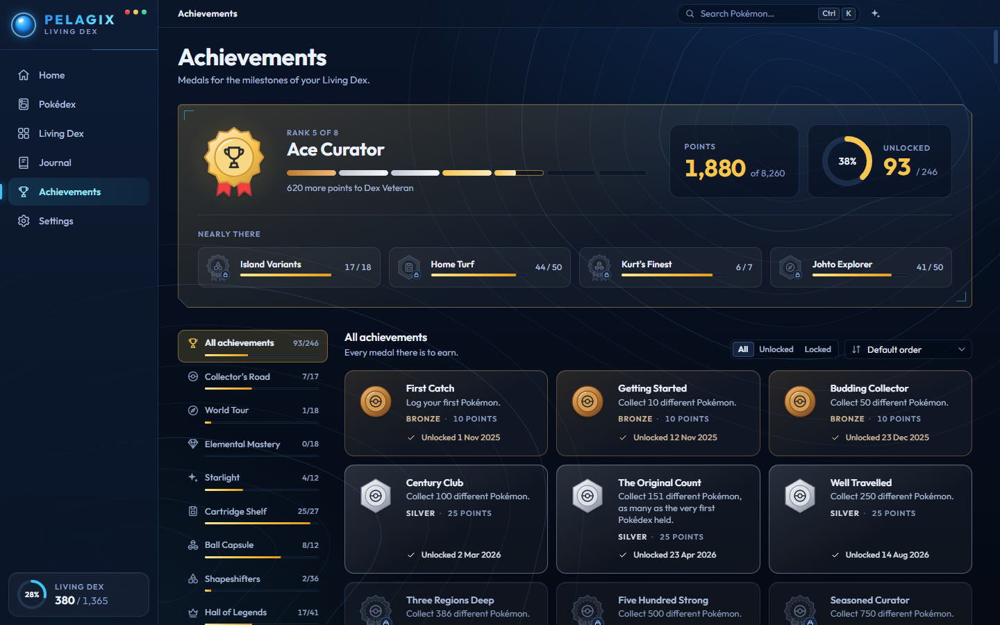

### Home dashboard

The first screen (pictured at the top of this page) shows where the collection stands:

- completion, shinies, species and entries, with buttons to log a catch, browse the Pokédex and
  open the Living Dex;
- **Continue the hunt**: Pokémon you are still missing, as silhouettes that link to their pages;
- **Generation progress**, region by region;
- **Recent catches**;
- **Your games** and the systems they run on;
- **Activity**: streaks and a twelve-month chart;
- **Type coverage** and **Balls used**;
- your achievement rank and latest medals.

On an empty save it greets you with a place to enter your trainer name and the three steps of
the first catch.

### Settings

- **Trainer**: your name, used in the greeting and as the default Original Trainer.
- **Living Dex rules**: see [Forms and the Living Dex rules](#forms-and-the-living-dex-rules).
- **Appearance**: language (see [Languages](#languages)), dark or light theme, reduce motion,
  and Pokédex tile density. Pelagix also
  follows your system's reduced-motion setting.
- **Your data**: where the save is, **Export save**, **Import save**, **Import from a game save**
  and **Reset**. Importing
  shows a summary first and lets you either merge the file's entries into your collection or
  replace everything. Reset asks you to type `RESET`. A merge, a replace and a reset can each be
  undone straight afterwards. **Import from a game save** reads a save file of a Pokémon game
  and offers the Pokémon in it as entries: you get a preview that marks each one as new, already
  imported, an egg (skipped) or not importable, and only the ones you tick are added. The save
  file is only read, never changed, and the import can be undone straight afterwards. Imported
  entries also get their ability, PID, IVs and EVs where the game has them, and importing a save again
  adds those to entries imported before 0.4.0. **Import from ShinyDex** does the same for a
  [ShinyDex](https://shinydex.com) history: choose the exported `.json`, or a saved copy of your
  History page, and its shinies are offered in the same preview with game, method and date (and
  the ball, from the saved page). Settings and achievements in the file are ignored.
- **Sprite cache**: how much is stored, and a button to clear it.
- **Updates**: your version, when it was last checked, **Check for updates**, and the switch for
  the automatic check. See [Updates](#updates).
- **About**: version, dataset details, keyboard shortcuts and credits.

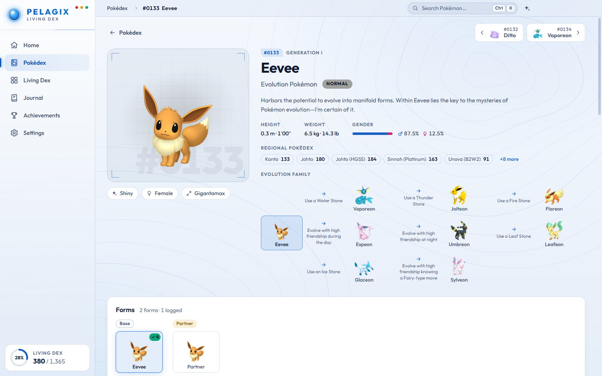

### Languages

From version 0.7.0, Pelagix comes in the ten languages of the Pokémon games: Japanese, English,
French, Italian, German, Spanish (Spain), Spanish (Latin America), Korean, Simplified Chinese
and Traditional Chinese.

- **Choosing**: the first time Pelagix starts, and once after updating from an older version, it
  asks which language you want and pre-selects the language of Windows. You can change it at any
  time in **Settings → Appearance → Language**; the change applies at once.
- **Pokémon wording is the games' own**: the names of Pokémon and their forms, categories,
  Pokédex entries, types, abilities, Poké Balls, game titles and most places are taken from the
  games' text (through PKHeX and PokeAPI), not translated by hand.
- **The interface is translated for this project** and has not been checked by native speakers,
  so some wording may be awkward. Corrections are welcome: each language is a folder of plain
  files in `src/renderer/src/i18n/`. Latin American Spanish shares the Spanish text and only
  holds what differs.
- **Your save is the same in every language.** What you log is stored the same way whatever the
  language, so you can switch without changing your entries, and nicknames, trainer names and
  notes stay exactly as you typed them or as they were in the imported game.
- **Search** finds a Pokémon by its name in your language and by its English name.

Still in English in every language: Pokédex entries of the newest Pokémon (National numbers 899
to 1025, and from 723 in both Chinese scripts), the names of a few forms and places the sources
do not have, the less common evolution methods, event titles, console names, release notes and
the installer.

### Search and keyboard shortcuts

`Ctrl+K` opens the search palette from anywhere. Type part of a name or a number to jump to any
Pokémon or form, to a page, or to a quick action: log a catch for the top result, turn shiny view
on or off, switch theme, or turn reduced motion on or off.

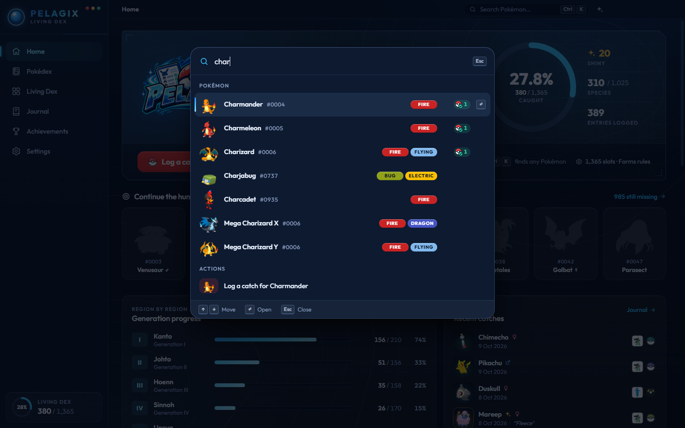

| Keys | Where | What it does |
| --- | --- | --- |
| `Ctrl+K` | Anywhere | Open the search palette |
| `↑` `↓` `Enter` | Search palette | Move through the results and open one |
| `/` | Pokédex | Jump to the search box |
| `←` `→` | A Pokémon's page | Previous or next Pokémon |
| `←` `→` | Living Dex slot drawer | Previous or next slot |
| Arrow keys, `Home`, `End` | Living Dex grid | Move between slots |
| `↑` `↓` `Home` `End` | Journal | Move between entries |
| `Ctrl+Enter` | Entry editor | Save the entry |
| `F6` | Anywhere | Jump to the newest notification, for example to reach its Undo, and back |
| `Esc` | Anywhere | Close a dialog, menu or search |

### Updates

From version 0.2.0, Pelagix looks for new versions on its
[Releases page](https://github.com/HydrosPlays/Pelagix/releases).

- **When it checks.** A few seconds after it starts, and every six hours while it stays open.
  Settings → Updates has a **Check for updates** button and a switch that turns the automatic
  check off.
- **What you see.** When a newer version exists, a window opens with the release notes of every
  version you are missing. It opens by itself once per version; after that an **Update available**
  marker stays at the foot of the navigation rail and reopens it.
- **Installed version.** **Download and install** fetches the update and shows its progress.
  **Restart and update** then closes Pelagix, installs the update into the same folder and reopens
  the app. Your save is written to disk first, and Pelagix will not restart while you are still
  editing an entry. A downloaded update is installed only by that button: closing Pelagix yourself
  leaves it waiting.
- **Portable version.** It shows the same notes, and its button opens the release page. You
  download the new file and replace the old one yourself.
- **After an update**, a *What's new* window shows the notes of the new version once.

What is sent: a check is an ordinary HTTPS request for public files on github.com, the release
notes come from api.github.com, and the update itself is downloaded from GitHub's release
storage. GitHub sees what any web server sees: your IP address, and that the request comes from
`Pelagix/<version>`. No account, identifier or cookie is sent, and nothing about your collection.
With the automatic check switched off, Pelagix makes these requests only when you press
**Check for updates** or start a download.

## Supported games

46 games and services on nine systems: 39 main-series games, 5 side games and 2 services.

| Generation | Games | System | Kind |
| --- | --- | --- | --- |
| I | Red, Green, Blue, Yellow | Game Boy | Main series |
| I | Stadium | Nintendo 64 | Side game |
| II | Gold, Silver, Crystal | Game Boy Color | Main series |
| II | Stadium 2 | Nintendo 64 | Side game |
| III | Ruby, Sapphire, Emerald, FireRed, LeafGreen | Game Boy Advance | Main series |
| III | Colosseum, XD: Gale of Darkness, Box: Ruby & Sapphire | Nintendo GameCube | Side games |
| IV | Diamond, Pearl, Platinum, HeartGold, SoulSilver | Nintendo DS | Main series |
| V | Black, White, Black 2, White 2 | Nintendo DS | Main series |
| VI | X, Y, Omega Ruby, Alpha Sapphire | Nintendo 3DS | Main series |
| VII | Sun, Moon, Ultra Sun, Ultra Moon | Nintendo 3DS | Main series |
| VII | Let's Go, Pikachu! and Let's Go, Eevee! | Nintendo Switch | Main series |
| VIII | Sword, Shield, Brilliant Diamond, Shining Pearl, Legends: Arceus | Nintendo Switch | Main series |
| IX | Scarlet, Violet, Legends: Z-A | Nintendo Switch | Main series |
| Other | Pokémon GO | Mobile | Service |
| Other | Pokémon HOME | Mobile and Nintendo Switch | Service |

How the side games and services appear:

- **Colosseum and XD** have their own source lists: Shadow Pokémon, gifts and Poké Spots.
- **Stadium, Stadium 2 and Box** have no encounters of their own. The Pokémon they hand out are
  listed under the game that receives them, tagged "via Pokémon Stadium" and so on. You can still
  choose them as the game when you log a catch.
- **Pokémon GO** lists which Pokémon are available there. It has no locations.
- **Pokémon HOME** gifts are listed under the game that receives them. HOME can be chosen as the
  game when you log a catch.
- **Pokémon Green** uses Blue's encounter tables.
- **Legends: Z-A** is filed under Nintendo Switch; it also runs on Nintendo Switch 2.

## The data

The reference data is generated, not maintained by hand. It is built from two open projects, with
a small set of hand-curated tables for what they lack, and checked by a validator before it ships.

| Source | What comes from it |
| --- | --- |
| [PKHeX](https://github.com/kwsch/PKHeX) | Encounters, the forms that exist, which Pokémon are in which game, evolutions, eggs and breeding, the balls of each game, event distributions and Pokémon GO availability |
| [PokeAPI](https://github.com/PokeAPI/pokeapi) | Names, categories, types, Pokédex text, height and weight, regional Pokédex numbers, and the keys of the Pokémon HOME renders |
| [PokeAPI/sprites](https://github.com/PokeAPI/sprites) | The Pokémon HOME renders themselves |

- **Size.** 1,025 species, 1,491 forms and 44,873 ways to obtain them across 46 games. That is
  one index file plus one file per species, about 4.6 MB of JSON, bundled inside the app.
- **Versions.** Built from PKHeX 26.08.26, PokeAPI at commit `2fe9553` and PokeAPI/sprites at
  commit `35fdbe9`. Settings → About shows the same details for the copy you are running.
- **Renders are not bundled.** Each Pokémon HOME render is downloaded the first time it is shown,
  from the PokeAPI/sprites repository (through the jsDelivr CDN, with GitHub as the fallback), and
  then kept in a cache on your computer. Apart from these downloads, the only network requests
  the app makes are for [updates](#updates).

[docs/DATA.md](docs/DATA.md) describes how the datasets are built, what "obtainable" means, and
the figures behind them.

### Known limitations

The app:

- **Importing needs a save file.** Pelagix can read a game's save file (Settings → Your data),
  which in practice means emulator saves and saves taken off a modded console. It does not
  connect to Pokémon HOME or Pokémon GO. Game Boy saves hold no met data, and for an evolved
  Pokémon the way it was first obtained is a best guess.
- **Windows only.** The only build that is set up and tested is 64-bit Windows.
- **English only**, for the interface and for the game data.
- **No sync.** To move a collection to another computer, export and import the save.
- **Only the installed version updates itself.** The portable version tells you about a new
  version, and you download it yourself. Version 0.1.0 has no updater at all.
- **Updates are not code-signed either.** A downloaded update is checked against the checksum
  published with the release, not against a signature. If Pelagix was installed for all users,
  Windows may ask for permission while an update installs.
- **Renders need the internet once.** A Pokémon whose render has never been downloaded shows a
  placeholder while you are offline. Everything else works offline, except checking for updates.
- **The shiny toggle is shared.** The sparkle button in the title bar and the Shiny mode of the
  Living Dex are the same switch, so turning on shiny renders in the Pokédex also opens the Living
  Dex in Shiny mode.
- **The date field in the editor** follows your system's date format, while the rest of the app
  writes dates as "9 Oct 2026".

The data:

- **"Obtainable" includes services that have since closed**: the Dream World, the Pokéwalker
  course that needed the GTS, the Friend Safari, and the Key System and Funfest Missions of
  Black 2 and White 2. The same goes for the gifts from My Pokémon Ranch, a WiiWare title that is
  no longer sold (this is why Mew is listed as obtainable in Diamond and Pearl), and for the
  Japan-only e-Reader Shadow Pokémon of Colosseum (Togepi, Mareep and Scizor).
- **Time-limited sources are kept apart as "Event only"**: Mystery Gift distributions, event
  raids and event mass outbreaks. Most can no longer be obtained. Gifts from Stadium, Stadium 2,
  Box and HOME are filed with them, although some of those are permanent rewards.
- **Some sources have no location**: many in-game trades from Generation V onward, a few gifts and
  eggs, some Hidden Grotto Pokémon, and everything in Pokémon GO.
- **Many wild encounters have no method label** and simply read "Wild". Poké Radar and DexNav
  encounters are not marked as such.
- **Level ranges are envelopes.** Two separate level bands at one place are shown as one range.
- **"Tall grass" or "Cave" is inferred from the place name** in the older games, and is wrong for
  some places that have both, such as Mt. Pyre and the Ruins of Alph.
- **Scarlet and Violet** rows never list the weather, and many of them are Pokémon that wander in
  from a neighbouring area.
- **Form changes are described in general terms**: the item or the action, not where to get it.
- **Evolution methods in the family tree** are worded as in the most recent game that has the
  evolution, so an older game's method can differ.
- **Event names are uneven.** Many distributions are simply titled "Pikachu gift", and some
  Original Trainer names appear in the language of the distribution.
- **Known oddities.** Diancie is listed as obtainable in Legends: Z-A although its Mystery Gift
  may have ended. Resolute Keldeo has no source in Legends: Z-A. A few Pokémon are event-only in
  unexpected games because a distribution exists there, such as Raichu in Colosseum.
- **Eight forms have no Pokémon HOME render of their own** and show the closest one, labelled as
  such: Partner Pikachu, Partner Eevee, Spiky-eared Pichu, Mega Meowstic (Female), Antique Sinistea
  and Polteageist, Artisan Poltchageist and Masterpiece Sinistcha. Seven of the cap Pikachu have
  no shiny render.
- **The "Shiny missing" filter** does not know which Pokémon are shiny-locked.
- **The data is as recent as its sources.** Anything released after PKHeX 26.08.26 is not in it.

If you find a wrong location or a missing source, an issue with the Pokémon, the game and what
the game actually does is the most useful report.

## Getting Pelagix

Download the latest version from the repository's
[Releases page](https://github.com/HydrosPlays/Pelagix/releases). You only need one of these two
files:

| File | What it is |
| --- | --- |
| `Pelagix-<version>-setup.exe` | The installer. It lets you choose the install folder, and from 0.2.0 on it updates itself from inside the app. About 120 MB. |
| `Pelagix-<version>-portable.exe` | A single file that runs without installing. It tells you when a new version is out, and you download that yourself. About 120 MB. |

A release also carries `latest.yml` and a `.blockmap` file. The updater reads those; you do not
need them. If you are on 0.1.0, which has no updater, download the newer file and run it: your
data stays where it is.

To build them yourself instead, see [Building from source](#building-from-source): `npm run dist`
writes the same files to `dist/`, beside electron-builder's own working files (`win-unpacked/`
and `builder-debug.yml`), which you can ignore.

Things to know before the first run:

- **Windows 10 or 11, 64-bit.**
- **The build is not code-signed.** Windows SmartScreen will warn the first time you run a copy
  that was downloaded ("Windows protected your PC"). Choose *More info*, then *Run anyway*, if you
  trust where the file came from.
- **An internet connection is needed the first time each Pokémon render is shown.** After that
  the render comes from the cache on your computer.
- **The portable build keeps your data in the same place as the installed one**
  (`%APPDATA%\Pelagix`). It is portable in the sense that it needs no installation, not that it
  carries your save with it. It does not replace itself with a new version: see
  [Updates](#updates).

## Where your data lives

Everything Pelagix writes is in its user-data folder, `%APPDATA%\Pelagix`, with one exception:
the installed version keeps downloaded updates in `%LOCALAPPDATA%\pelagix-updater`, which
uninstalling removes. Settings → Your data shows the exact path of the save.

| Path | Contents |
| --- | --- |
| `save.json` | Your save: every logged catch, your trainer name, Living Dex rules and theme, and your unlocked achievements. |
| `backups\save-YYYYMMDD.json` | The save as it was before the first change of that day. The newest 14 are kept. |
| `save.corrupt-<timestamp>.json` | A save that could not be read. It is moved aside and the newest backup is restored in its place. |
| `sprite-cache\` | Downloaded Pokémon renders and their thumbnails. Safe to delete; it can also be cleared from Settings. |
| `window.json` | Window size, position and theme. |
| `updates.json` | What the updater remembers on this computer: the automatic-check switch, when it last checked, and release notes it has fetched. |
| `updates.log` | The updater's log, for when an update goes wrong. Kept small. |

- The save is written atomically, to a temporary file that is flushed and then renamed, so an
  interrupted write cannot leave a half-written file.
- **Export save** writes a readable copy wherever you choose, named
  `pelagix-save-YYYY-MM-DD.json` by default. **Import save** reads such a file back, and lets you
  merge it or replace your collection with it.
- A few per-device preferences, such as tile size, sort orders and the shiny toggle, are kept
  with the app's browser storage in the same folder. They are not part of the save or of an export.

## Building from source

**You need**

- Windows 10 or 11, 64-bit
- [Node.js](https://nodejs.org/) 24 and npm 11 (developed with Node 24.18 and npm 11.16)
- Git

```
git clone https://github.com/HydrosPlays/Pelagix.git
cd Pelagix
npm install
```

| Command | What it does |
| --- | --- |
| `npm run dev` | Starts the app in Electron with hot reload. The first run downloads the Electron binary. |
| `npm test` | Runs the unit tests (1,845 tests in 56 files). |
| `npm run dist` | Builds the save reader, type-checks, builds, and packages the installer, the portable executable and the updater's files into `dist/`. Needs the .NET 10 SDK and the `PKHeX/` tree. Nothing is uploaded. |

The datasets and the game icons are part of the repository, so nothing else has to be generated
before the app runs. [docs/DEVELOPMENT.md](docs/DEVELOPMENT.md) lists every script and explains
how the app is put together.

<details>
<summary><b>Regenerating the datasets (optional)</b></summary>

<br>

You only need this after changing the data tooling or to pick up a newer PKHeX. It needs the
[.NET SDK 10](https://dotnet.microsoft.com/download) and two other projects' source trees in the
project root. Both folders are git-ignored and are only ever read.

```
git clone --depth 1 --branch 26.08.26 https://github.com/kwsch/PKHeX PKHeX
git clone --depth 1 https://github.com/PokeAPI/pokeapi PokeAPI
npm run data
```

- `PKHeX/` is what the extractor in `tools/extractor` compiles against. It was written against
  PKHeX 26.08.26 and targets .NET 10. A newer PKHeX may need changes to the extractor.
- `PokeAPI/` is read for a single file, `data/v2/csv/pokemon_species_flavor_text.csv` (the
  Pokédex text). The other PokeAPI tables are pinned copies in `data/sources/pokeapi-upstream/`,
  which `node tools/fetch-sources.ts --force` downloads again.
- `npm run data` runs three steps: `data:extract` (PKHeX to `data/pkhex/`), `data:build` (writes
  `src/renderer/public/data/`) and `data:validate` (checks the result).

On the committed datasets the validator reports: *Checked 1025 species, 1491 forms, 44873 rows:
768899 checks, 452 known facts. All structural invariants hold and every known fact is reproduced.*

</details>

<details>
<summary><b>Regenerating the screenshots</b></summary>

<br>

```
npm run screenshots
```

This builds the app, starts it on a generated demo save in a scratch profile
(`%TEMP%\pelagix-screenshots`) and writes the 18 pictures to `docs/screenshots/`. It takes about a
minute, needs a network connection for the renders, and a display of at least 1440 × 900. Your
own save is never opened. Options go after `--`, for example
`npm run screenshots -- --only 04,05`. See [tools/screenshots/README.md](tools/screenshots/README.md).

</details>

## Project structure

```
src/
  main/              Electron main process: window, save file, sprite cache, updates, IPC
  preload/           The bridge that exposes window.api to the interface
  shared/            Types and static data used by the app and by the data tools
                     (games, balls, sprites, dataset and save formats)
  renderer/          The interface (React)
    public/data/       The built datasets: dex.json and species/<id>.json
    public/games/      Game icons as shipped
    src/components/    Shared components
    src/features/      One folder per page: home, pokedex, species, entry, living,
                       homedex, journal, achievements, settings, search, updates
    src/domain/        Living Dex slots, progress, encounters, achievements
    src/lib/           Data loading, sprites, storage, search, animation helpers
    src/store/         The save and the interface state
    src/shell/         The app frame: navigation rail, title bar, routing
tools/
  extractor/         .NET program that reads PKHeX
  save-reader/       .NET program, shipped with the app, that reads a game save file
  build-data/        Builds and validates the datasets
  screenshots/       Takes the pictures on this page
data/sources/        Pinned PokeAPI tables and the list of HOME renders
games/               Game icons (originals)
build/               App icon, and the script that draws it
docs/                Screenshots and further documentation
dist/                Packaged executables (git-ignored)
```

## Tech stack

| Layer | Built with |
| --- | --- |
| Shell | [Electron](https://www.electronjs.org/) 44, packaged with electron-builder, updated with electron-updater |
| Build | [electron-vite](https://electron-vite.org/) and [Vite](https://vite.dev/) 7 |
| Interface | [React](https://react.dev/) 19 and TypeScript, plain CSS |
| State | [zustand](https://github.com/pmndrs/zustand) |
| Animation | [anime.js](https://animejs.com/) 4 |
| Routing and lists | wouter and TanStack Virtual |
| Tests | [Vitest](https://vitest.dev/) |
| Data tooling | Node.js running TypeScript directly, and a .NET 10 extractor built on PKHeX.Core |
| Save import | A .NET 10 reader built on PKHeX.Core, shipped beside the app and run on a save file you pick |

## Credits and licence

Pelagix is free software, released under the
[GNU General Public License, version 3](LICENSE).

- Encounter, location, form, evolution and availability data is derived from
  [PKHeX](https://github.com/kwsch/PKHeX) by kwsch and contributors, which is licensed under the
  GNU General Public License version 3.
- Names, types, Pokédex text and render keys come from
  [PokeAPI](https://pokeapi.co/) ([source](https://github.com/PokeAPI/pokeapi)).
- Pokémon HOME renders are not part of Pelagix. They are loaded on demand from the
  [PokeAPI/sprites](https://github.com/PokeAPI/sprites) repository and cached on your computer.

Pokémon and all related names and images are trademarks and copyright of Nintendo, Game Freak,
Creatures and The Pokémon Company. Pelagix is an unofficial, fan-made tool. It is not affiliated
with, sponsored by or endorsed by any of them.
